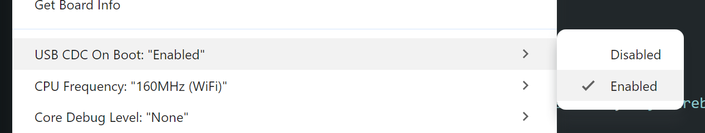

# BTHomeV2-Arduino
[](https://www.ardu-badge.com/BTHomeV2-Arduino)
## BTHome is an open standard for broadcasting sensor data and button presses over Bluetooth LE 

[](https://bthome.io/)
[](https://www.home-assistant.io/integrations/bthome/)
[](https://esphome.io)

**BTHomeV2-Arduino can work with OR without ESPHome**

In fact it can work without HomeAssistant entirely if you are wanting to roll your own parser.

The goal of this library is to easily develop devices that can send out BTHome events;
More information on BTHome https://bthome.io/

Check the progress table below to see if your requested feature is available. 
Create an issue if you want to see something added.

BTHome makes it easier to add very low power sensing devices to your Home Network using standard Arduino devices such as any ESP32, or more specifically the ultra low power,  battery driven devices such as the FireBeetle 2 ESP32-C6.

## Why use BTHome? 

Power usage is the main consideration.

A BLE Advertisement, which is used by BTHome:  
- requires no connection.
- is fast to send, only taking a few milliseconds. 
- the wake, sense, send, sleep cycle can be less than a second

Wifi is
- slow to connect, 
- requires handshakes and IP resolutions
- uses MUCH more power 

## Supported Platforms

### Home Assistant + esphome

Connection through ESPHome requires the use of a ESP32 as a Bluetooth BLE Proxy. I recommend using the *nodemcu32* as this *just works!*
Get the `ESP32-WROOM-32U` with the external antenna for the best range.
There is an example config for the BT proxy in the examples folder.

After installing the [BTHome](https://www.home-assistant.io/integrations/bthome/) plugin, the devices should start showing up as discovered devices.

### Home Assistant Only

Similar to above, but instead of ESPHome, install a Bluetooth plugin for Home Assistant.
After installing the [BTHome](https://www.home-assistant.io/integrations/bthome/) plugin, the devices should start showing up as discovered devices.

## Development

### Arduino IDE

Arduino IDE is supported by this library, and has the best board support for Arduino. 

### VSCode + PlatformIO

This code should with PlatformIO too, but it's secondary to the Arduino IDE. 
The reason is that the low power boards like the *Firebeetle 2 ESP32 C6* are not supported by PlatformIO (at time of writing).

## Example code and config

Refer to the directory `./examples`  for specific library implementations.

- esphome proxy configuration
- NimBLE BLE Library 

### NimBLE Example
Nimble Repository: https://github.com/h2zero/NimBLE-Arduino

Example file: [./examples/NimBLE/NimBLE.ino](./examples/NimBLE/NimBLE.ino)

```cpp
  // #include <BtHomeV2Device.h>

  // Build advertising data
  BtHomeV2Device btHome("DIY-sensor", "My DIY Sensor", false);
  btHome.addCount_0_255(22);
  uint8_t buffer[MAX_PAYLOAD_SIZE];
  size_t size = btHome.getAdvertisementData(buffer);

  // Generated advertisement data:
  // 02 01 06 0e 09 4d 79 20 44 49 59 20 53 65 6e 73 6f 72 06 16 d2 fc 40 09 16
  // 02 01 06 (<- Initial Flags)  
  // 0e (<- Length) 09 (<- Complete Name) 4d 79 20 44 49 59 20 53 65 6e 73 6f 72 (<- My DIY Sensor) 
  // 06 (<- Length) 16 (<- Service Data ) d2 fc ( <- BTHome UUID ) 
  // 40 ( <- BTHomeV2 / Encryption / Trigger Device ) 09 (<- Count 0-255 )  16 (<-'25')

  // Setting up the BLE

  NimBLEDevice::init("");
  NimBLEAdvertising* pAdvertising = NimBLEDevice::getAdvertising();
  NimBLEAdvertisementData pAdvData = BLEAdvertisementData(); 
  std::vector<uint8_t> data(buffer, buffer + size); // convert the buffer to something NimBLE takes 
  pAdvData.addData(data);
  pAdvertising->setAdvertisementData(pAdvData);
  pAdvertising->setConnectableMode(0);
  Serial.println("Starting advertising...");
  pAdvertising->start();
  delay(1000);
  pAdvertising->stop();
  delay(1000);
  Serial.println("Advertising data sent.");
```

## Troubleshooting 

If you are using the [FireBeetle2 ESP-C6](https://wiki.dfrobot.com/SKU_DFR0975_FireBeetle_2_Board_ESP32_C6), or any other `ESP32-C*`, you may need to enable USB CDC to see the Serial output. 



# Credits 
Thanks to @Chreece and @TheDigital1 + other contributors for providing a good base to work from.

- https://github.com/Chreece/BTHomeV2-ESP32-example
- https://github.com/TheDigital1/ESP32_BTHome

Thanks to @Bluetooth-Devices for the docs

- https://github.com/Bluetooth-Devices


## Implementation Progress

### No Encryption currently planned

I'm currently not looking at encryption. I might look at implementing it in the future.

### Data Types 

Quite a few things to implement, but hopefully will get through them all.

| Type   | Object id | Property              | Progress | Notes                                                                              |
| ------ | --------- | --------------------- | -------- | ---------------------------------------------------------------------------------- |
| Sensor | 0x51      | acceleration          |          |                                                                                    |
| Sensor | 0x01      | battery               | Done     |                                                                                    |
| Sensor | 0x60      | channel               |          |                                                                                    |
| Sensor | 0x12      | co2                   |          |                                                                                    |
| Sensor | 0x56      | conductivity          |          |                                                                                    |
| Sensor | 0x09      | count                 | Done     |                                                                                    |
| Sensor | 0x3D      | count                 | Done     |                                                                                    |
| Sensor | 0x3E      | count                 | Done     |                                                                                    |
| Sensor | 0x59      | count                 | Done     | Not showing in HA                                                                  |
| Sensor | 0x5A      | count                 | Done     | Not showing in HA                                                                  |
| Sensor | 0x5B      | count                 | Done     | Not showing in HA                                                                  |
| Sensor | 0x43      | current               |          |                                                                                    |
| Sensor | 0x5D      | current               |          |                                                                                    |
| Sensor | 0x08      | dewpoint              |          |                                                                                    |
| Sensor | 0x5E      | direction             |          |                                                                                    |
| Sensor | 0x40      | distance (mm)         | Done     | Showing as metres in HA https://github.com/Bluetooth-Devices/bthome-ble/issues/247 |
| Sensor | 0x41      | distance (m)          | Done     |                                                                                    |
| Sensor | 0x42      | duration              |          |                                                                                    |
| Sensor | 0x4D      | energy                |          |                                                                                    |
| Sensor | 0x0A      | energy                |          |                                                                                    |
| Sensor | 0x4B      | gas                   |          |                                                                                    |
| Sensor | 0x4C      | gas                   |          |                                                                                    |
| Sensor | 0x52      | gyroscope             |          |                                                                                    |
| Sensor | 0x03      | humidity              | Done     |                                                                                    |
| Sensor | 0x2E      | humidity              | Done     |                                                                                    |
| Sensor | 0x05      | illuminance           |          |                                                                                    |
| Sensor | 0x06      | mass (kg)             |          |                                                                                    |
| Sensor | 0x07      | mass (lb)             |          |                                                                                    |
| Sensor | 0x14      | moisture              |          |                                                                                    |
| Sensor | 0x2F      | moisture              |          |                                                                                    |
| Sensor | 0x0D      | pm2.5                 |          |                                                                                    |
| Sensor | 0x0E      | pm10                  |          |                                                                                    |
| Sensor | 0x0B      | power                 |          |                                                                                    |
| Sensor | 0x5C      | power                 |          |                                                                                    |
| Sensor | 0x5F      | precipitation         |          |                                                                                    |
| Sensor | 0x04      | pressure              |          |                                                                                    |
| Sensor | 0x54      | raw                   | Done     |                                                                                    |
| Sensor | 0x3F      | rotation              |          |                                                                                    |
| Sensor | 0x44      | speed                 |          |                                                                                    |
| Sensor | 0x57      | temperature           | Done     |                                                                                    |
| Sensor | 0x58      | temperature           | Done     |                                                                                    |
| Sensor | 0x45      | temperature           | Done     |                                                                                    |
| Sensor | 0x02      | temperature           | Done     |                                                                                    |
| Sensor | 0x53      | text                  | Done     |                                                                                    |
| Sensor | 0x50      | timestamp             | Done     | Uses the epoch seconds. Use your own library for time management.                  |
| Sensor | 0x13      | tvoc                  |          |                                                                                    |
| Sensor | 0x0C      | voltage               |          |                                                                                    |
| Sensor | 0x4A      | voltage               |          |                                                                                    |
| Sensor | 0x4E      | volume                |          |                                                                                    |
| Sensor | 0x47      | volume                |          |                                                                                    |
| Sensor | 0x48      | volume                |          |                                                                                    |
| Sensor | 0x55      | volume storage        |          |                                                                                    |
| Sensor | 0x49      | volume flow rate      |          |                                                                                    |
| Sensor | 0x46      | UV index              |          |                                                                                    |
| Sensor | 0x4F      | water                 |          |                                                                                    |
|        |           |                       |          |                                                                                    |
| binary | 0x15      | battery  (normal/low) | Done     |                                                                                    |
| binary | 0x16      | battery charging      | Done     |                                                                                    |
| binary | 0x17      | carbon monoxide       | Done     |                                                                                    |
| binary | 0x18      | cold                  | Done     |                                                                                    |
| binary | 0x19      | connectivity          | Done     |                                                                                    |
| binary | 0x1A      | door                  | Done     |                                                                                    |
| binary | 0x1B      | garage door           | Done     |                                                                                    |
| binary | 0x1C      | gas                   | Done     |                                                                                    |
| binary | 0x0F      | generic boolean       | Done     |                                                                                    |
| binary | 0x1D      | heat                  | Done     |                                                                                    |
| binary | 0x1E      | light                 | Done     |                                                                                    |
| binary | 0x1F      | lock                  | Done     |                                                                                    |
| binary | 0x20      | moisture              | Done     |                                                                                    |
| binary | 0x21      | motion                | Done     |                                                                                    |
| binary | 0x22      | moving                | Done     |                                                                                    |
| binary | 0x23      | occupancy             | Done     |                                                                                    |
| binary | 0x11      | opening               | Done     |                                                                                    |
| binary | 0x24      | plug                  | Done     |                                                                                    |
| binary | 0x10      | power                 | Done     |                                                                                    |
| binary | 0x25      | presence              | Done     |                                                                                    |
| binary | 0x26      | problem               | Done     |                                                                                    |
| binary | 0x27      | running               | Done     |                                                                                    |
| binary | 0x28      | safety                | Done     |                                                                                    |
| binary | 0x29      | smoke                 | Done     |                                                                                    |
| binary | 0x2A      | sound                 | Done     |                                                                                    |
| binary | 0x2B      | tamper                | Done     |                                                                                    |
| binary | 0x2C      | vibration             | Done     |                                                                                    |
| binary | 0x2D      | window                | Done     |                                                                                    |
|        |           |                       |          |                                                                                    |
| button | 0x00      | None                  | Done     | Button state must transition from None to another State to register                |
| button | 0x01      | press                 | Done     |                                                                                    |
| button | 0x02      | double_press          | Done     |                                                                                    |
| button | 0x03      | triple_press          | Done     |                                                                                    |
| button | 0x04      | long_press            | Done     |                                                                                    |
| button | 0x05      | long_double_press     | Done     |                                                                                    |
| button | 0x06      | long_triple_press     | Done     |                                                                                    |
| button | 0x80      | hold_press            | Done     |                                                                                    |
|        |           |                       |          |                                                                                    |
| dimmer | 0x00      | None                  | Done     | Dimmer state must transition from None to another state to register                |
| dimmer | 0x01      | rotate left           | Done     |                                                                                    |
| dimmer | 0x02      | rotate right          | Done     |                                                                                    |
|        |           |                       |          |                                                                                    |
| misc   | 0x00      | packet id             |          |                                                                                    |
|        |           |                       |          |                                                                                    |
| device | 0xF0      | device type id        |          |                                                                                    |
| device | 0xF1      | firmware version      |          |                                                                                    |
| device | 0xF2      | firmware version      |          |                                                                                    |

